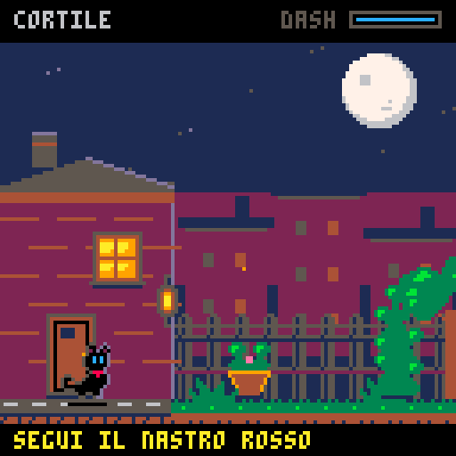

# Fuori, Nero!

Un gatto nero, una notte fuori casa e un nastro rosso da ritrovare. Prototipo PICO-8 per un metroidvania compatto: il cortile è una piccola stanza giocabile che presenta salto, graffio, morso e dash.



## Gioca

La cartuccia completa è **[nero-fuori.p8](nero-fuori.p8)**: contiene codice, sprite e suoni.

- **PICO-8:** apri la cartuccia e digita `run`.
- **Browser:** apri la gratuita [PICO-8 Education Edition](https://www.pico-8-edu.com/), avviala, trascina il file `.p8` nella finestra e digita `run`.

Premi Z o X nella schermata iniziale. Attraversa il cortile e recupera il nastro rosso per terminare la demo. Dal menu di pausa puoi ricominciare.

| Comando | Azione |
| --- | --- |
| Frecce sinistra/destra | Muovi |
| Z | Salta; tienilo premuto per saltare più in alto |
| X | Graffia e taglia i rampicanti |
| Giù + X | Mordi e rompi la cassa |
| Doppio tocco sinistra/destra | Dash e sfondamento del cartone |
| Z o X dopo il traguardo | Ricomincia |

## Revisione grafica

Sprite originali da 16×16 pixel, dodici pose del gatto, palette standard di 16 colori, occhi azzurri e bordo di luce per la sagoma nera. Casa illuminata, tetti con parallasse, vegetazione, particelle e scia dello scatto completano il cortile. La grafica viene disegnata alla risoluzione nativa di **128×128**, a **60 aggiornamenti al secondo**.

La [guida alla direzione artistica](docs/ART_DIRECTION.md) raccoglie le fonti sulla pixel art, le scelte applicate e l'organizzazione dell'atlante.

## Sorgenti

| File | Contenuto |
| --- | --- |
| `src/game.lua` | Logica, collisioni, animazioni e disegno della scena |
| `assets/sprites.txt` | Matrici dei pixel, modificabili in un editor di testo |
| `tools/build_cart.py` | Assemblaggio della cartuccia con la libreria standard Python |
| `tools/verify_cart.cjs` | Verifica nel runtime ufficiale via Playwright |

Dopo una modifica alle sorgenti, rigenera la cartuccia:

```sh
python3 tools/build_cart.py
```

Se modifichi gli sprite direttamente in PICO-8, riporta le modifiche nelle matrici prima di rigenerare il file.

## Verifica

La revisione è stata eseguita in **PICO-8 Education Edition**. Sono stati verificati avvio, salto, collisioni, attacchi corretti e sbagliati, attacco sopra la cassa, doppio tocco, traguardo e riavvio. [Dettagli e limiti](docs/VERIFICATION.md).

Per ripetere la verifica automatica servono Node.js, Playwright, Chromium e accesso alla Education Edition:

```sh
npm install --no-save --package-lock=false playwright
npx playwright install chromium
node tools/verify_cart.cjs
```

Puoi usare un Chromium già installato con `CHROMIUM_PATH=/percorso/chromium`. La verifica aggiorna le anteprime in `docs/`.

Questa è ancora una stanza prototipo; esplorazione su più aree, nemici e abilità da sbloccare richiedono ulteriore sviluppo.

## Copertina


