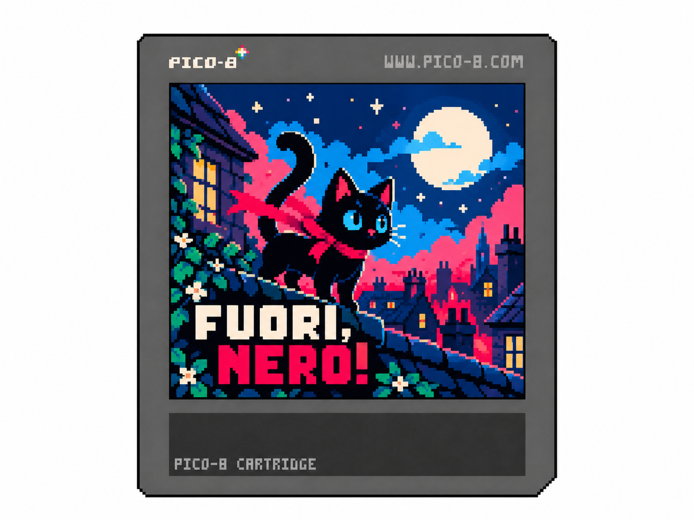

# Fuori, Nero!

Prototipo PICO-8 per un metroidvania compatto con protagonista un gatto nero.

## Cartuccia

- `nero-fuori.p8` — stanza iniziale del cortile con movimento, combattimento semplice e ostacoli interattivi.

## Comandi

- Frecce: muovi
- Z: salta
- X: graffia
- Giù + X: morde
- Doppio tocco sinistra/destra: dash

Il graffio taglia i rampicanti, il morso rompe la cassa e il dash sfonda il cartone.

## Stato

È una prima bozza giocabile. Il runtime ufficiale PICO-8 non era installato nell'ambiente di sviluppo, quindi la cartuccia non è ancora stata eseguita in PICO-8.
