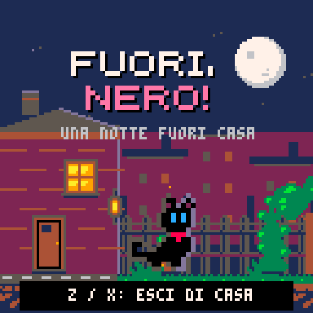

# Direzione artistica: il cortile di Nero

## Riferimenti studiati

- [Derek Yu — Pixel Art Tutorial](https://www.derekyu.com/makegames/pixelart.html): silhouette, palette limitata, luce, pulizia dei contorni e leggibilità di personaggi piccoli.
- [Cure — Pixel Art Tutorial, Pixel Joint](https://pixeljoint.com/forum/forum_posts.asp?TID=11299): gruppi di pixel coerenti, contrasto, rampe di colore; esempi di rumore, banding e illuminazione concentrica da evitare.
- [Lexaloffle — Manuale PICO-8](https://www.lexaloffle.com/dl/docs/pico-8_manual.html): risoluzione, palette, sprite, trasparenza, camera, limiti e aggiornamento a 60 Hz.
- [PICO-8 Education Edition](https://www.pico-8-edu.com/): runtime ufficiale utilizzato per controllare il risultato alla risoluzione nativa.

Consultati il 4 ottobre 2026. Gli sprite del gioco sono disegnati per questo progetto.

## Principi applicati

| Principio | Applicazione nel gioco |
| --- | --- |
| Sagoma leggibile | Testa grande, orecchie separate, coda curva e zampe con pose distinte in 16×16 pixel |
| Gruppi di pixel | Corpo, foglie e ombre formano masse compatte; i punti isolati sono occhi, stelle, lucciole e riflessi |
| Palette limitata | Solo i 16 colori standard PICO-8; nessuna sfumatura o filtro sulle immagini |
| Luce direzionale | Grigio scuro sul bordo in ombra, lavanda sul bordo verso la luna; luce calda da finestra e lanterna |
| Gerarchia del contrasto | Nero e i suoi occhi azzurri si staccano dall'ambiente; tetti lontani usano colori più scuri e meno dettagli |
| Materiali riconoscibili | Rampicanti verdi, cassa con assi e diagonali, cartone con nastro chiaro |
| Animazione leggibile | Corsa con appoggio, compressione e raccolta delle zampe; pose dedicate a salto, caduta e attacchi |
| Movimento della scena | Camera morbida, skyline che scorre al 22% della camera, luna al 4%; interfaccia ferma sullo schermo |

L'effetto di luce è una scelta di pixel e colori, senza sfocatura. Le anteprime sono esportate dal runtime a scala intera **4×**, senza interpolazione.

## Nero

Il nero della pelliccia è **opaco**: `palt(0,false)`. Il colore 15 è riservato alla trasparenza: `palt(15,true)`. Questo consente di conservare il corpo nero anche quando lo sprite passa davanti a una finestra o alla vegetazione.

| Colore PICO-8 | Uso principale |
| --- | --- |
| 0 | Pelliccia e ombra |
| 5 e 13 | Contorno in ombra e bordo illuminato |
| 12 | Occhi e scia dello scatto |
| 8 e 14 | Nastro e accento rosso/rosa |
| 3 e 11 | Foglie e riflessi sulla vegetazione |
| 4, 9 e 10 | Legno, cartone e luci calde |
| 1 e 2 | Cielo, skyline e superfici lontane |

Le dodici pose sono: fermo, occhi chiusi, quattro fotogrammi di corsa, salto, caduta, dash, graffio, morso e accovacciata. Il graffio aggiunge tre segni brevi; il dash lascia copie della sagoma che svaniscono. Atterraggi e distruzione degli ostacoli producono particelle del materiale.

## Atlante degli sprite

Le matrici sono in [`assets/sprites.txt`](../assets/sprites.txt). Ogni intestazione `@ nome x y` indica la posizione in pixel nell'atlante; i caratteri `0`–`e` indicano i colori e `.` indica la trasparenza.

| Elemento | Posizione e dimensioni |
| --- | --- |
| Otto pose principali | `y=0`, `x=0,16,…,112`; ciascuna 16×16 |
| Dash, graffio, morso, accovacciata | `y=16`, `x=0,16,32,48`; ciascuna 16×16 |
| Cassa, cartone, rampicanti, porta | `y=16`, `x=64,80,96,112`; altezze 24/32/32/24 |
| Prato, terreno, pietre | `y=32`, `x=0,8,16`; ciascuno 8×8 |
| Recinzione | `(48,32)`, 8×24 |
| Piattaforma, nastro, vaso, finestra | `(0,40)`, `(40,40)`, `(56,40)`, `(112,40)` |
| Ciuffi, chioma, lanterna | `(0,48)`, `(16,48)`, `(32,48)` |

L'atlante occupa soltanto i primi **128×64 pixel** della memoria degli sprite. La metà inferiore rimane disponibile per la memoria condivisa con la mappa. Il generatore controlla colori, righe, limiti e sovrapposizioni.

## Schermata iniziale

